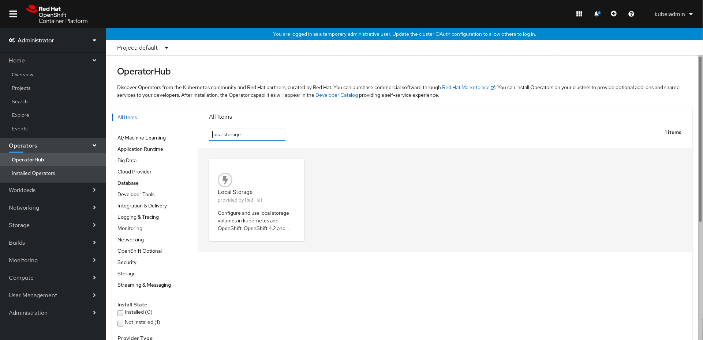
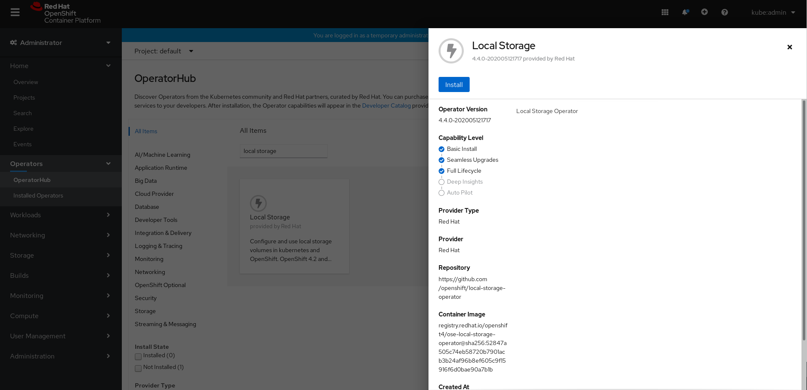
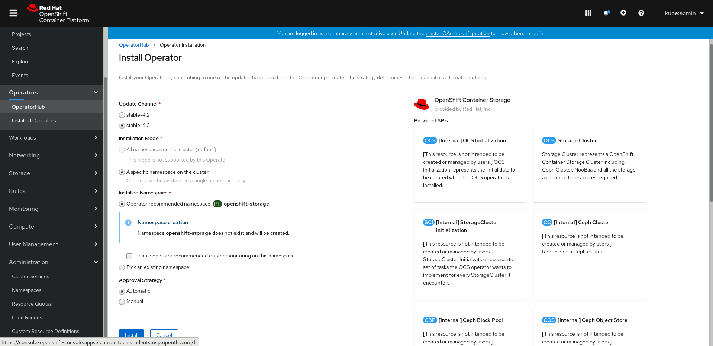

= OpenShift virtualization (CNV) High Touch Beta Test Plan
:toc:
:numbered:
:toclevels: 3

== Installation

=== Red Hat OpenShift Container Platform

==== Installer Provisioned Infrastructure

The recommended installation method for the OpenShift virtualization high-touch beta is
"Installer Provisioned Infrastructure" (IPI), which is documented
https://openshift-kni.github.io/baremetal-deploy/4.4/Deployment.html[here].

Note the following.

.2.1. https://openshift-kni.github.io/baremetal-deploy/4.4/Deployment.html#node-requirements_ipi-install-prerequisites[Node requirements]

UEFI boot is required *only* if IPv6 is used on the provisioning network.

.2.2. https://openshift-kni.github.io/baremetal-deploy/4.4/Deployment.html#network-requirements_ipi-install-prerequisites[Network requirements]

Ensure that no DHCP server is running on the *provisioning* network.  The *baremetal* network
requires an external DHCP server, with a reserved address for each node.  (See _Reserving IP
Addresses for Nodes with the DHCP Server_.)

.4. https://openshift-kni.github.io/baremetal-deploy/4.4/Deployment.html#preparing-the-provisioner-node-for-openshift-install_ipi-install-prerequisites[Preparing the provisioner node for OpenShift Container Platform installation]
{empty} +
_Step 5_

If necessary, a subscription can be manually attached to the provisioner node.  In this case, omit
the `+--auto-attach+` option from the `subscription-manager register ...` command.  After registering
the node, list the available subscriptions with `subscription-manager list --available` and note
the *Pool ID* of the correct subscription.  (If possible, copy the 32-digit pool ID to the
clipboard.)  Use `subscription-manager attach --pool ...` to attach the correct subscription to
the node.

Disabling any automatically enabled repositories is also recommended, so a complete sequence might
look like this:

```
[kni@provisioner ~]$ sudo subscription-manager register
...
[kni@provisioner ~]$ sudo subscription-manager list --available
...
[kni@provisioner ~]$ sudo subscription-manager attach --pool=...
...
[kni@provisioner ~]$ sudo subscription-manager repos --disable=*
...
[kni@provisioner ~]$ sudo subscription-manager repos --enable=rhel-8-for-x86_64-appstream-rpms --enable=rhel-8-for-x86_64-baseos-rpms
...

```

_Step 11_

If using IPv4 on the *provisioning* network, set the address with `ipv4.addresses` and `ipv4.method`
(rather than `ipv6.addresses` and `ipv6.method`).  For example:

```
[kni@provisioner ~]$ export PUB_CONN=ens4
[kni@provisioner ~]$ export PROV_CONN=ens3
```

Change these values to match your environment.

IMPORTANT: The command below should restore the provisioner node's network connection.  In the
event of a typo or error, however, it is recommended that a console connection (serial or BMC) be
available.

```
[kni@provisioner ~]$ sudo -E nohup bash -c '
    nmcli con down "$PROV_CONN"
    nmcli con down "$PUB_CONN"
    nmcli con delete "$PROV_CONN"
    nmcli con delete "$PUB_CONN"
    nmcli con down "System $PUB_CONN"
    nmcli con delete "System $PUB_CONN"
    nmcli connection add ifname provisioning type bridge con-name provisioning
    nmcli con add type bridge-slave ifname "$PROV_CONN" master provisioning
    nmcli connection add ifname baremetal type bridge con-name baremetal
    nmcli con add type bridge-slave ifname "$PUB_CONN" master baremetal
    nmcli con down "$PUB_CONN";pkill dhclient;dhclient baremetal
    nmcli connection modify provisioning ipv4.addresses 172.22.0.1/24 ipv4.method manual
    nmcli con down provisioning
    nmcli con up provisioning
    nmcli con up baremetal
'
```

.5. https://openshift-kni.github.io/baremetal-deploy/4.4/Deployment.html#_retrieving_openshift_installer[Retrieving the OpenShift Installer]

Follow the instructions in
https://openshift-kni.github.io/baremetal-deploy/4.4/Deployment.html#retrieving-openshift-installer-ga[Section 5.2]
to retrieve the GA version of the OpenShift installer.

.5.2.2. https://openshift-kni.github.io/baremetal-deploy/4.4/Deployment.html#extracting-the-openshift-installer_ipi-install-prerequisites[Extracting the OpenShift Container Platform installer (GA Release)]

It may be necessary to install the `tar` RPM before executing step 2.

.6. https://openshift-kni.github.io/baremetal-deploy/4.4/Deployment.html#ipi-install-creating-an%20rhcos-images-cache_ipi-install-prerequisites[Creating an RHCOS images cache (Optional)]

This section provides optional instructions for running an `httpd` container on the provisioner node, to
serve as an RHCOS image cache.  It is also possible to use a completely separate HTTP, as long as
the server is accessible from the *baremetal* network.  Use steps 5 through 10 of this section to
determine the source URLs and hashes of the images.

After completing steps 5 though 10, the source URLs can be displayed, e.g.:

```
[kni@installer ~]$ echo ${RHCOS_PATH}${RHCOS_QEMU_URI}
https://releases-art-rhcos.svc.ci.openshift.org/art/storage/releases/rhcos-4.4/44.81.202004250133-0/x86_64/rhcos-44.81.202004250133-0-qemu.x86_64.qcow2.gz

[kni@installer ~]$ echo ${RHCOS_PATH}${RHCOS_OPENSTACK_URI}
https://releases-art-rhcos.svc.ci.openshift.org/art/storage/releases/rhcos-4.4/44.81.202004250133-0/x86_64/rhcos-44.81.202004250133-0-openstack.x86_64.qcow2.gz
```

These URLs can be used to download the images, which can then be made available from an existing
HTTP server.  (The hash values will be used in the `bootstrapOSImage` and `clusterOSImage` values
in `install-config.yaml`.)

.7.1. Configuring the `install-config.yaml` file

If using an RHCOS image cache, add `bootstrapOSImage` and `clusterOSImage` items to the `baremetal`
section.  For example, if the HTTP server is serving images from `http://10.11.173.1/pub/ocp/4.4/`,
determine the URLs:

```
[kni@installer ~]$ echo http://10.11.173.1/pub/ocp/4.4/${RHCOS_QEMU_URI}?sha256=${RHCOS_QEMU_SHA_UNCOMPRESSED}
http://10.11.173.1/pub/ocp/4.4/rhcos-44.81.202004250133-0-qemu.x86_64.qcow2.gz?sha256=7d884b46ee54fe87bbc3893bf2aa99af3b2d31f2e19ab5529c60636fbd0f1ce7

[kni@installer ~]$ echo http://10.11.173.1/pub/ocp/4.4/${RHCOS_OPENSTACK_URI}?sha256=${RHCOS_OPENSTACK_SHA_COMPRESSED}
http://10.11.173.1/pub/ocp/4.4/rhcos-44.81.202004250133-0-openstack.x86_64.qcow2.gz?sha256=370a5abf8486d2656b38eb596bf4b2103f8d3b1faaca8bfb2f086a16185c2d1b
```

And reference the URLs in `install-config.yaml`:

```
...
platform:
  baremetal:
    bootstrapOSImage: http://10.11.173.1/pub/ocp/4.4/rhcos-44.81.202004250133-0-qemu.x86_64.qcow2.gz?sha256=7d884b46ee54fe87bbc3893bf2aa99af3b2d31f2e19ab5529c60636fbd0f1ce7
    clusterOSImage: http://10.11.173.1/pub/ocp/4.4/rhcos-44.81.202004250133-0-openstack.x86_64.qcow2.gz?sha256=370a5abf8486d2656b38eb596bf4b2103f8d3b1faaca8bfb2f086a16185c2d1b
...
```

The subnet specified by the `provisioningNetworkCIDR` should match the IP address (`ipv4.addresses`
or `ipv6.addresses`) specified for the *provisioning* interface on the provisioner node.

.7.3. https://openshift-kni.github.io/baremetal-deploy/4.4/Deployment.html#creating-the-openshift-manifests_ipi-install-prerequisites[Creating the OpenShift Container Platform manifests]
{empty}

IMPORTANT: This step will delete the copy of `install-config.yaml` in the `clusterconfigs` directory.
Ensure that you keep a copy.

When a non-zero number of worker nodes is configured, the control plane will not be schedulable, so
the output will be:

```
[kni@installer ~]$ sudo ./openshift-baremetal-install --dir ~/clusterconfigs create manifests
INFO Consuming Install Config from target directory 
WARNING Discarding the Openshift Manifests that was provided in the target directory because its dependencies are dirty and it needs to be regenerated 
```

==== User Provisioned Infrastructure

If the IPI installation
method is not feasible, the "User Provisioned Infrastructure" (UPI) method can be used.  Bare-metal
UPI installations are documented
https://docs.openshift.com/container-platform/4.4/installing/installing_bare_metal/installing-bare-metal.html[here].

=== OpenShift virtualization

* Install OpenShift virtualization by following the steps https://docs.openshift.com/container-platform/4.4/cnv/cnv_install/installing-container-native-virtualization.html[here].
** Install the `virtctl` utility. This tool is a CLI-based utility that allows you to interface with an OpenShift virtualization cluster and bridges some of the gaps between the virtualisation world and the world that Kubernetes was designed for. For example, the `virtctl` tool provides the capability of managing the lifecycle of virtual machines (starting, stopping, restarting, etc), providing access to the virtual consoles, uploading virtual machine images, as well as interfacing with Kubernetes constructs such as services and routes. It is installed using the Red Hat subscription manager tooling. Follow the installation instructions https://docs.openshift.com/container-platform/4.4/cnv/cnv_install/cnv-installing-virtctl.html[here] on the host with access to the OpenShift API.

=== OpenShift Container Storage

OpenShift Container Storage (OCS) is a software-defined storage solution allowing container-native storage to be deployed and managed directly from within OpenShift.
For the High Touch Beta we are recommending to install OCS to use the disks on your worker nodes directly. This can be done by following the steps in the documentation as follows:

** Review the https://access.redhat.com/documentation/en-us/red_hat_openshift_container_storage/4.3/html-single/deploying_openshift_container_storage/index#requirements-for-installing-openshift-container-storage-using-local-storage-devices_rhocs[Requirements for installing OpenShift Container Storage using local storage devices] and ensure worker nodes are labelled as per the example there.

   $ oc label nodes worker-0 cluster.ocs.openshift.io/openshift-storage=''
   node/worker-0 labeled
   $ oc label nodes worker-1 cluster.ocs.openshift.io/openshift-storage=''
   node/worker-1 labeled
   $ oc label nodes worker-2 cluster.ocs.openshift.io/openshift-storage=''
   node/worker-2 labeled

   oc get nodes -l cluster.ocs.openshift.io/openshift-storage=
   NAME       STATUS   ROLES    AGE    VERSION
   worker-0   Ready    worker   5m7s   v1.18.2
   worker-1   Ready    worker   28m    v1.18.2
   worker-2   Ready    worker   28m    v1.18.2

** To find available storage https://access.redhat.com/documentation/en-us/red_hat_openshift_container_storage/4.3/html-single/deploying_openshift_container_storage/index#finding-available-storage-devices_rhocs[devices on workers]

   $ export KUBECONFIG=/home/cloud-user/scripts/ocp/auth/kubeconfig
   $ oc get nodes
   NAME       STATUS   ROLES    AGE    VERSION
   master-0   Ready    master   59m    v1.18.2
   master-1   Ready    master   51m    v1.18.2
   master-2   Ready    master   60m    v1.18.2
   worker-0   Ready    worker   4m9s   v1.18.2
   worker-1   Ready    worker   27m    v1.18.2
   worker-2   Ready    worker   27m    v1.18.2

   $ oc debug node/worker-0
   Starting pod/worker-0-debug ...
   To use host binaries, run `chroot /host`
   Pod IP: 10.20.0.200
   If you don't see a command prompt, try pressing enter.

   sh-4.2# chroot /host
   sh-4.4# lsblk
   NAME                         MAJ:MIN RM  SIZE RO TYPE MOUNTPOINT
   vda                          252:0    0  100G  0 disk
   |-vda1                       252:1    0  384M  0 part /boot
   |-vda2                       252:2    0  127M  0 part /boot/efi
   |-vda3                       252:3    0    1M  0 part
   |-vda4                       252:4    0 99.4G  0 part
   | `-coreos-luks-root-nocrypt 253:0    0 99.4G  0 dm   /sysroot
   `-vda5                       252:5    0   65M  0 part
   vdb                          252:16   0  100G  0 disk

** https://access.redhat.com/documentation/en-us/red_hat_openshift_container_storage/4.3/html-single/deploying_openshift_container_storage/index#installing-local-storage-operator_rhocs[Install the Local Storage Operator]

** Example of installation of Local Storage Operator
*** Navigate to Administration->Namespaces and create a local-storage namespace:


**** Navigate to Operators->Operator Hub and search for local storage and click on Local Storage operator:



**** Click on the Local Storage Install button:



*** Once the operator is installed it will be listed as installed under the local-storage namespace:


** https://access.redhat.com/documentation/en-us/red_hat_openshift_container_storage/4.3/html-single/deploying_openshift_container_storage/index#installing-openshift-container-storage-operator-using-the-operator-hub_rhocs[Install Red Hat OpenShift Container Storage Operator using the Operator Hub].

** Example of installing OCS Operator:

*** Navigate to Operators->Operator Hub and search for openshift-container and click on OpenShift Container Storage operator:


*** Click on the OpenShift Container Storage Install button:


*** Fill in the options for the OCS operator and click install:



*** After clicking the install wait for the operator status to reflect installed:


** https://access.redhat.com/documentation/en-us/red_hat_openshift_container_storage/4.3/html-single/deploying_openshift_container_storage/index#creating-openshift-container-storage-cluster-on-bare-metal_rhocs[Create an OpenShift Storage cluster] using those devices on bare metal with command line interface.

[TIP]
When creating your StorageCluster CR note the sizing for the storageDeviceSets. As per the suggested note, you could just set this to "1" if preferred.

*** Example of local-storage.yml using block device instead of device-by-id

    apiVersion: local.storage.openshift.io/v1
    kind: LocalVolume
    metadata:
      name: local-block
      namespace: local-storage
    spec:
      nodeSelector:
        nodeSelectorTerms:
        - matchExpressions:
            - key: cluster.ocs.openshift.io/openshift-storage
              operator: In
              values:
              - ""
      storageClassDevices:
       - storageClassName: localblock
          volumeMode: Block
         devicePaths:
           - /dev/vdb

** Creating a OpenShift Container Storage cluster via UI

*** Under Operators->Installed Operators click on the OpenShift Container Storage operator in the list of operators in the openshift-storage namespace:


*** Next click on the Storage Cluster tab which will display a button to the right for creating the OCS cluster service.  Click on the create button:


*** This will bring up the an options screen where the nodes labeled as OCS storage nodes will be pre-checked:


*** Click the create button and the screen will show a progress indicator and begin to instantiate the OCS cluster:


*** Once the OCS cluster has installed the console will display the cluster status as ready:


** https://access.redhat.com/documentation/en-us/red_hat_openshift_container_storage/4.3/html-single/deploying_openshift_container_storage/index#verifying-your-openshift-container-storage-installation_rhocs[Verify that the installation has been successful and everything is healthy].

== Creating and Managing Virtual Machines, Networking, and Storage

=== Prerequisites to running a VM

==== Set up Storage

Virtual Machines require RWX storage to run. For bare metal installs you basically have two options to provide this: NFS or OpenShift Container Storage (OCS).

===== OpenShift Container Storage (OCS)

Steps to set up OCS are above. Once running create an SC and UPDATEME

===== NFS

An existing or purpose-built NFS server can be used to host storage. While the steps to setup your own NFS environment may vary here are some examples and some things to consider.

*** Review the
    https://docs.openshift.com/container-platform/4.4/storage/persistent_storage/persistent-storage-nfs.html#nfs-volume-security_persistent-storage-nfs[NFS
    ownership, permission, and export considerations].  (Note that the SELinux section
    only applies to Red Hat Enterprise Linux worker nodes; Red Hat Enterprise Linux CoreOS is
    pre-configured with the appropriate SELinux policy and settings.)

*** OpenShift does not have an in-tree
    https://kubernetes.io/docs/concepts/storage/dynamic-provisioning/[dynamic volume provisioner] for NFS so
    each NFS-backed persistent volume must be individually created.

*** You NFS backend should provide unique directories for each PV you create. You can't place them all in the same directory or previous content will be removed with next use.

*** As an example here are the basic steps to create a simple NFS setup on a RHEL 8 machine. This is not supported for production and is only intended to give a fast working example for comparison.

  $ mkdir /mnt/nfs/{one,two,three,four}
  $ chmod -R 777 /mnt/nfs/
  $ cat > /etc/exports << EOF
   /mnt/nfs     *(rw,sync,no_wdelay,no_root_squash,insecure,fsid=0)
  EOF
  $ for s in rpcbind nfs-server; do systemctl start $s; systemctl enable $s; done
  $ setsebool -P nfs_export_all_rw 1
  $ setsebool -P nfs_export_all_ro 1
  $ semanage fcontext -a -t public_content_rw_t  "/mnt/nfs(/.*)?"
  $ restorecon -R /mnt/nfs

*** You'll need to create a Storage Class with the kubernetes.io/no-provisioner provisioner. Because NFS doesn't support dynamic provisioning you need the StorageClass to delay volume binding until the the pods are scheduled.
This can be done from the UI under Storage -> Storage Classes -> Create Storage Class. Make sure to select kubernetes.io/no-provisioner. As YAML this will look something like:

  kind: StorageClass
  apiVersion: storage.k8s.io/v1
  metadata:
    name: noprovisionsc
    annotations:
      description: A basic Storage Class
  provisioner: kubernetes.io/no-provisioner
  reclaimPolicy: Delete
  volumeBindingMode: WaitForFirstConsumer

*** As mentioned, you'll need to create a Physical Volume for each NFS directory you plan to utilise. This can be created at anytime prior to making a PVC against an NFS-backed PV.
Again, this is not dynamic so they need to be created manually by you in advance. Using our simple NFS setup example above our PV claim, in YAML, might looks like this:

  apiVersion: v1
  kind: PersistentVolume
  metadata:
    name: rhel-nfs-one-pv
  spec:
    capacity:
      storage: 40Gi
    accessModes:
      - ReadWriteOnce
      - ReadWriteMany
    persistentVolumeReclaimPolicy: Delete
    storageClassName: noprovisionsc
    nfs:
      path: /mnt/nfs/one
      server: 1.2.3.4

Update "path:" for each directory on the NFS server and reference the no-provisioner StorageClass you created.

With the StorageClass and Persistent Volumes set up you are now ready to use NFS for OpenShift virtualzation.

==== Provide Source Operating System Image for Virtual Machine.

There are currently four defined methods to provide a source image for virtual machine

* PXE

** OpenShift virtualzation supports network booting an image from a PXE server
** Configuring PXE booting can be found https://access.redhat.com/documentation/en-us/openshift_container_platform/4.4/html/container-native_virtualization/virtual-machines#configuring-pxe-booting[here]

* URL

** Prepared OS images can be provided via an http or S3 endpoint.
*** A good example OS image is one for CentOS 7, found https://cloud.centos.org/centos/7/images/CentOS-7-x86_64-GenericCloud.qcow2[here]

** With NFS the image can be used in two ways:
*** Create a PVC at the time of VM creation by importing the image and running the VM.
*** Create a PVC prior to VM launch by importing the image into a PVC using https://github.com/kubevirt/containerized-data-importer[CDI]. To do this the PVC must use the "cdi.kubevirt.io/storage.import.endpoint:" notation. In this example a PVC will be created and the OS image referenced will be imported into it prior to VM launch. The PVC is available to be then be used when launching a VM.

  apiVersion: v1
  kind: PersistentVolumeClaim
  metadata:
  name: "rhel-nfs-four-pvc"
  labels:
    app: containerized-data-importer
  annotations:
    cdi.kubevirt.io/storage.import.endpoint: "https://cloud.centos.org/centos/7/images/CentOS-7-x86_64-GenericCloud.qcow2"
  spec:
  volumeMode: Filesystem
  storageClassName: genericsc
  accessModes:
  - ReadWriteMany
  resources:
    requests:
      storage: 40Gi

** With OCS the image ...
*** UPDATEME

* Container

** Provision virtual machine from a bootable operating system container located in a registry accessible from the cluster.
The easiest way to do this is to use the default template provided with OpenShift virtualization. Simply go to Virtual Machines -> Create Virtual Machine -> New from YAML
There you will see the YAML to run a Cirros VM in the default namespace.
Choose "Create" and OpenShift virtualzation will create the Cirros VM in the pod network.

* Virtual Machine Disks
** Provision a virtual machine from a disk which contains an imported Operating system image as explained previously.
** Provision a virtual machine from a DataVolume object. DataVolume objects are custom resources that are provided by the Containerized Data Importer (CDI) project. DataVolumes orchestrate import, clone, and upload operations that are associated with an underlying PersistentVolumeClaim (PVC). DataVolumes are integrated with KubeVirt, and they prevent a virtual machine from being started before the PVC has been prepared.
*** You can upload a locally stored disk image to a https://docs.openshift.com/container-platform/4.4/cnv/cnv_virtual_machines/cnv_virtual_disks/cnv-uploading-local-disk-images-virtctl.html[new or existing DataVolume.]
*** You can upload a locally stored disk image into a https://docs.openshift.com/container-platform/4.4/cnv/cnv_virtual_machines/cnv_virtual_disks/cnv-uploading-local-disk-images-block.html#cnv-about-block-pvs_cnv-uploading-local-disk-images-block[block DataVolume.]

==== Networking

===== Pod networking (masquerade)
** By default a VM is created on the internal pod network via the https://docs.openshift.com/container-platform/4.4/cnv/cnv_virtual_machines/cnv_vm_networking/cnv-using-the-default-pod-network-with-cnv.html[masquerade binding method].
Pod networking is also referred to as "masquerade mode" when it's related to OpenShift virtualization.
** Masquerade mode uses Network Address Translation (NAT) to connect virtual machines to the Pod network backend through a Linux bridge. Masquerade mode is the recommended binding method for VM's that need to use (or have access to) the default pod network.
It's also the default networking setting for VMs (via the UI creation wizard). For the CLI it is set via the `masquerade: {}` method.

TIP: You can see the IP of a running VM by running `oc get vmi/vm-name`

*** Running the VM in masquerade mode means you'll need to manage how the VM interacts with the outside world using the usual OpenShift networking constructs such as services and routes. For this you must use the `virtctl` utility.
Details on using `virtctl` are available https://docs.openshift.com/container-platform/4.4/cnv/cnv-using-the-cli-tools.html#cnv-using-the-cli-tools[here].
The command works just like the `oc` command for doing the same with pods.

*** To expose port 80 on `my-vm` use `virtctl`:

  $ virtctl expose virtualmachineinstance my-vm --name myvm-http --port 80`
  Service myvm-http successfully exposed for virtualmachineinstance my-vm

  $ oc get svc/myvm-http
  NAME            TYPE        CLUSTER-IP      EXTERNAL-IP   PORT(S)   AGE
  myvm-http     ClusterIP   172.30.202.35   <none>        80/TCP    34s

*** Create routes with `oc`:

  $ oc create route edge --service=vmname-http
  route.route.openshift.io/vmname-http created

  $ oc get routes
  NAME            HOST/PORT                                    PATH   SERVICES        PORT    TERMINATION   WILDCARD
  vmname-http     vmname-http-default.apps.inc.example.com            vmname-http     <all>   edge          None

TIP: With `virtctl` you can easily work with your VM in a pod network setup.

===== Bridge Networking
** Bridge Networking brings real-world virtualization networking constructs like bridged networking, SR/IOV, to OpenShift virtualization. You can also combine pod networking and a bridged interface directly attached to a VM at the same time, using Multus, the default networking CNI in OpenShift 4.x.
NOTE: Bridge networking requires some preparation to OCP before you can use it with VMs.

*** Setting up Bridge Networking
**** For this method of networking OpenShift utilises additional NICs on the workers which are plumbed into an external network that an admin may want to have access to. Internally the workers have a software bridge created to attach the OpenShift VMs to.
**** Setting up this bridge can be done using the OpenShift virtualization tool `nmstate` combined with applying a `NodeNetworkConfigurationPolicy` to a cluster. Full details are found https://docs.openshift.com/container-platform/4.4/cnv/cnv_node_network/cnv-observing-node-network-state.html[here].
**** Review the available NICs on a node with `nmstate`:

  $ oc get nns/worker-0.inc.example.com  -o yaml | grep -B 2 name
  creationTimestamp: "2020-05-13T15:16:57Z"
  generation: 1
  name: worker-0.inc.example.com
  --
  - apiVersion: v1
    kind: Node
    name: worker-0.inc.example.com
  --
        enabled: false
      mtu: 1450
      name: br0
  --
      mac-address: 10:7D:1A:7F:55:D5
      mtu: 1500
      name: eno1
  --
      mac-address: 10:7D:1A:7F:55:D8
      mtu: 1500
      name: eno2
  --
      mac-address: 3C:FD:FE:CF:08:CC
      mtu: 1500
      name: enp6s0f0
  --
      mac-address: 3C:FD:FE:CF:08:CD
      mtu: 1500
      name: enp6s0f1

**** Use `NetworkNodeConfigurationPolicy` to create a Linux bridge on that physical interface. For example the following YAML creates the a `linux-bridge` called `br1` on the NIC `enp6s0f0` on all workers (`node-role.kubernetes.io/worker`):

  kind: NodeNetworkConfigurationPolicy
  metadata:
    name: br1-enp6s0f0-policy-workers
  spec:
    nodeSelector:
      node-role.kubernetes.io/worker: ""
    desiredState:
      interfaces:
        - name: br1
          description: Linux bridge with enp6s0f0 as a port
          type: linux-bridge
          state: up
          ipv4:
            enabled: false
          bridge:
            options:
              stp:
                enabled: false
            port:
              - name: enp6s0f0


**** Once a bridge is created on the nodes OpenShift needs a `NetworkAttachmentDefinition` to allow VMs to plug in to it. This can be created via CLI or UI. Find full details https://docs.openshift.com/container-platform/4.4/cnv/cnv_virtual_machines/cnv_vm_networking/cnv-attaching-vm-multiple-networks.html[here].
***** A simple example illustrates how to create a `NetworkAttachmentDefinition` called `br1-bridge-network` on the `br1` linux bridge.

  apiVersion: "k8s.cni.cncf.io/v1"
  kind: NetworkAttachmentDefinition
  metadata:
    name: br1-bridge-network
    annotations:
      k8s.v1.cni.cncf.io/resourceName: bridge.network.kubevirt.io/br1
  spec:
    config: '{
      "cniVersion": "0.3.1",
      "name": “bridge-conf”,
      "plugins": [
        {
          "type": "cnv-bridge",
          "bridge": "br1"
        },
        {
          "type": “cnv-tuning"
        }
      ]
    }'

**** `br1-bridge-network` is now available, either via the VM wizard or CLI, to plug in to the linux bridge external network beyond it!

  apiVersion: v1
  kind: VirtualMachine
  metadata:
    name: example-vm
    annotations:
      k8s.v1.cni.cncf.io/networks: a-bridge-network
  spec:

=== VM Lifecycle Operations

==== Running Virtual Machines

* Virtual Machines
** Creating https://access.redhat.com/documentation/en-us/openshift_container_platform/4.4/html/container-native_virtualization/virtual-machines#cnv-create-vms[virtual machines]
** Editing https://access.redhat.com/documentation/en-us/openshift_container_platform/4.4/html/container-native_virtualization/virtual-machines#cnv-edit-vms[virtual machines]
** Changing boot order https://access.redhat.com/documentation/en-us/openshift_container_platform/4.4/html/container-native_virtualization/virtual-machines#cnv-edit-boot-order[virtual machines]
** Deleting https://access.redhat.com/documentation/en-us/openshift_container_platform/4.4/html/container-native_virtualization/virtual-machines#cnv-delete-vms[virtual machines]
** Controlling states of https://access.redhat.com/documentation/en-us/openshift_container_platform/4.4/html/container-native_virtualization/virtual-machines#cnv-controlling-vm-states[virtual machines]
** Accessing https://access.redhat.com/documentation/en-us/openshift_container_platform/4.4/html/container-native_virtualization/virtual-machines#cnv-accessing-vm-consoles[virtual machines]
** Installing VirtIO driver on new Windows https://access.redhat.com/documentation/en-us/openshift_container_platform/4.4/html/container-native_virtualization/virtual-machines#cnv-installing-virtio-drivers-on-new-windows-vm[virtual machine]
** Advanced management of https://access.redhat.com/documentation/en-us/openshift_container_platform/4.4/html/container-native_virtualization/virtual-machines#advanced-virtual-machine-management[virtual machines]
** Import of https://access.redhat.com/documentation/en-us/openshift_container_platform/4.4/html/container-native_virtualization/virtual-machines#importing-virtual-machines[virtual machine]
** Cloning of https://access.redhat.com/documentation/en-us/openshift_container_platform/4.4/html/container-native_virtualization/virtual-machines#cloning-virtual-machines[virtual machine]
** Networking options of https://access.redhat.com/documentation/en-us/openshift_container_platform/4.4/html/container-native_virtualization/virtual-machines#virtual-machine-networking[virtual machines]
** Managing disks of https://access.redhat.com/documentation/en-us/openshift_container_platform/4.4/html/container-native_virtualization/virtual-machines#virtual-machine-disks[virtual machines]

==== Running Virtual Machines from Template

Virtual machine templates are created just like virtual machines. You use the same import options and methods however the output is a reusable template for machine creation.
When creating Virtual Machine Templates PVCs will be created on template creation and used by VMs created from the template.

** Creating template https://access.redhat.com/documentation/en-us/openshift_container_platform/4.4/html/container-native_virtualization/virtual-machine-templates#cnv-creating-vm-template[virtual machine]
** Editing template https://access.redhat.com/documentation/en-us/openshift_container_platform/4.4/html/container-native_virtualization/virtual-machine-templates#cnv-editing-vm-template[virtual machine]
** Enabling dedicated resources https://access.redhat.com/documentation/en-us/openshift_container_platform/4.4/html/container-native_virtualization/virtual-machine-templates#cnv-dedicated-resources-vm-template[virtual machine]

=== Operating System Tasks for Virtual Machines

What follows are some ideas for testing OpenShift virtulization in your environment. Try them across operating systems and with many different tools.

* Linux
** Register VM with Satellite or RHSM
** Update VM packages
** Install backup agent and perform backup (if applicable)
** Mount network filesystem (NFS) and perform data transfer
** Perform disk performance test
** Perform network performance test

* Windows
** Install VirtIO driver if not yet installed
** Run WindowsUpdate
** Install backup agent and perform backup (if applicable)
** Mount network filesystem (CIFS) and perform data transfer
** Perform disk performance test (if applicable)
** Perform network performance test (if applicable)

=== Application Tasks

* Load any(!) application on virtual machine
* Updating an application on an existing virtual machine
* Restoring an application to a new or existing virtual machine
* Disaster and load scenarios
** Spinning up a new virtual machine running an application in parallel with another virtual
   machine, directing traffic from existing to new, STONITH when done.
* Deploy via a CI/CD pipeline
** To a running machine
** Including creating the machine
* Migration scenarios for moving apps/vms to OpenShift virtualization
** 3rd party tool to go from host to host
** Clone from one virt tech (vmware, rhv, etc) into image and import into openshift virtualization
** Pointing an existing CI/CD pipeline to OpenShift virtualization
** Some bespoke custom thing! :P
* Connect Application to an external storage solution
* Connect Application to (ie consume) OCS/NooBa?
* VM application as part of a heterogeneous pod/VM deployment

=== Red Hat technology use case ideas
* Run Satellite in OpenShift virtulization
** Experiment with HA and disaster recovery solutions used for this app by traditional virtualization solutions and compare
* Run Cloudforms in OpenShift virtulization
** Experiment with HA and disaster recovery solutions used for this app by traditional virtualization solutions and compare
* Run IMS (migration tooling) in OpenShift virtulization
* Run JBoss in OpenShift virtualization
** Experiment with HA and disaster recovery solutions used for this app by traditional virtualization solutions and compare
* Run Red Hat Ansible Tower on OpenShift virtualization
** Experiment with HA and disaster recovery solutions used for this app by traditional virtualization solutions and compare


=== Pre-packaged or existing applications running in VMs
* Standard IT Infrastructure VMs (i.e. Windows and Linux File Servers)
* Standard IT applications (i.e. MSFT Exchange, SharePoint, JIRA, Confluence)
* Standard application runtimes (WebSphere)
* Enterprise databases (Oracle, MFST SQL Server, IBM DB2, MySQL, MongoDB, on either Windows or Linux)
* Run as many layers of these solutions (front end, db, etc) all in OpenShift virtualization

=== Live Migrating Virtual Machines

* Configure limits and timeouts for https://access.redhat.com/documentation/en-us/openshift_container_platform/4.4/html/container-native_virtualization/live-migration#cnv-live-migration-limits[live migrate]
* Live migrate https://access.redhat.com/documentation/en-us/openshift_container_platform/4.4/html/container-native_virtualization/live-migration#cnv-migrate-vmi[virtual machine]
* Monitor live migrate of https://access.redhat.com/documentation/en-us/openshift_container_platform/4.4/html/container-native_virtualization/live-migration#cnv-monitor-vmi-migration[virtual machine]
* Cancel live migrate of https://access.redhat.com/documentation/en-us/openshift_container_platform/4.4/html/container-native_virtualization/live-migration#cnv-cancel-vmi-migration[virtual machine]

== Managing OpenShift virtualization

=== Node Maintenance & Virtual Machine Live Migration

* Launch a few virtual machines both using standard templates and custom templates.
* For custom virtual machines ensure they have an https://access.redhat.com/documentation/en-us/openshift_container_platform/4.4/html/container-native_virtualization/live-migration#cnv-configuring-vmi-eviction-strategy[eviction strategy]
* To ensure cluster is not overwhelmed by live migrations configure (if not done previously) https://access.redhat.com/documentation/en-us/openshift_container_platform/4.4/html/container-native_virtualization/live-migration#cnv-live-migration-limits[live migration limits and timeouts]
* Place a node that has some of the virtual machines on it into https://access.redhat.com/documentation/en-us/openshift_container_platform/4.4/html/container-native_virtualization/node-maintenance#cnv-setting-node-maintenance[maintenance mode]
* As the node is draining validate the virtual machines https://access.redhat.com/documentation/en-us/openshift_container_platform/4.4/html/container-native_virtualization/live-migration#cnv-monitor-vmi-migration[live migration]

=== Logging, Events, and monitoring

* View events, logs and configure virtual machine health probes of https://access.redhat.com/documentation/en-us/openshift_container_platform/4.4/html/container-native_virtualization/logging-events-and-monitoring[virtual machines]

=== Disasters

* Simulate a worker node failure with VM running on it
** Identify and/or launch a new virtual machine
** Identify the worker node the virtual machine is running on
** Turn off power to the worker node either by shutting down -or- pulling power cable.  Note if powercycling the OCP cluster will attempt to power on the node.
** From the console observe the status and behavior.  VM should start on another node within the cluster.

=== Lifecycle Cluster Operations
* Prerequisite
** Ensure there are a variety of virtual machines running across the OCP cluster
* Scale Node on OpenShift Container Platform (UI)
** Go to Compute->BareMetal Hosts-> Create Host.  Add new worker information in the required fields and click create.


** After the create button is pressed the node will be powered on and inspected.  Once complete it will appear with an available status.


** Navigate to Compute->Machine Sets and click on Edit Machine Count from the right hand drop down of the worker group to add the additional worker.


** Increase the machine count by the numbder of workers to be added.  In this example just one node.  Click save when complete.


** Once the machine count is raised the system will go out and automatically start the provisioning process of the worker node:


** When the provisioning process of the node is complete the status will show provisioned:


** Finally if we go back to Compute-Nodes we should see the additional worker in the node list as ready.


* Scale Node on OpenShift Container Platform (CLI)
** Create a baremetal node yaml with the following contents and save as bmh.yml

   apiVersion: v1
   kind: Secret
   metadata:
     name: worker-3-bmc-secret
   type: Opaque
   data:
     username: YWRtaW4=   <--- username needs to be base64 encoded
    password: cmVkaGF0   <---- password needs to be base64 encoded
   ---
   apiVersion: metal3.io/v1alpha1
   kind: BareMetalHost
   metadata:
     name: worker-3
   spec:
    online: true
     bootMACAddress: de:ad:be:ef:00:52
     hardwareProfile: openstack
     bmc:
       address: ipmi://10.20.0.3:6200
       credentialsName: worker-3-bmc-secret


** Create the baremetal host

   oc -n openshift-machine-api create -f bmh.yaml

** Node should power up and be inspected.  Node will get marked ready once inspection is complete

   oc -n openshift-machine-api get bmh

** Get the openshift-machineset-api name and desired count

   oc get machineset -n openshift-machine-api

** Scale the node replicas by adding one to the desired count

   oc -n openshift-machine-api scale machineset <machineset name> --replicas=<desired node count+1>

** Node provisioning can take as long as 30 minutes.  Once complete though the node should be marked as provisioned

   oc -n openshift-machine-api get bmh

* Scale Nodes and Storage for OpenShift Container Storage
** Follow the process to add nodes/scale storage for https://access.redhat.com/documentation/en-us/red_hat_openshift_container_storage/4.3/html/managing_openshift_container_storage/scaling-storage-nodes_rhocs[OpenShift Container Storage]
* Upgrade OpenShift Virtualization
** Follow the process to upgrade https://access.redhat.com/documentation/en-us/openshift_container_platform/4.4/html/container-native_virtualization/upgrading-container-native-virtualization[OpenShift virtualization]
* Upgrade OpenShift Container Storage
** Follow the process to upgrade https://access.redhat.com/documentation/en-us/red_hat_openshift_container_storage/4.3/html/managing_openshift_container_storage/upgrading-your-cluster_rhocs[OpenShift Container Storage]

=== Customer Specific Testing

* Reserved for customer specific testing that might not be incorporated in the test plan above.  This open ended testing allows for customer to vet out anything they would like to see the product perform.  Depending on tests and outcomes this could lead to additional product bugs and/or RFE's being opened.

=== Remove OpenShift Virtualization

* Via the web console uninstall https://access.redhat.com/documentation/en-us/openshift_container_platform/4.4/html/container-native_virtualization/container-native-virtualization-installation#uninstalling-container-native-virtualization[OpenShift virtualization].
